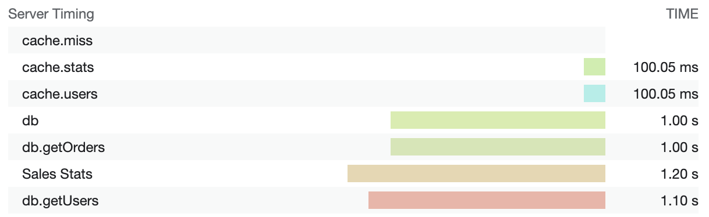

# @eligundry/server-timing

This package is a framework agnostic helper class to construct [`Server-Timing` headers][st-mdn].

## Installation

```bash
$ npm install -S @eligundry/server-timing
```

**This module is ESM only!** I apologize in advance for the pain that you might feel in the short term!

## Usage

```typescript
import ServerTiming from '@eligundry/server-timing'

const handler = async () => {
  const serverTiming = new ServerTiming()

  // Functions can be tracked manually
  serverTiming.start('db')
  await db.query()
  serverTiming.end('db')

  // Timing calls can be chained
  serverTiming.start('db.getUsers')
  const users = await db.getUsers()
  serverTiming.end('db.getUsers').start('cache.users')
  await cache.set('users', users)
  serverTiming.end('cache.users')

  // All of this is nice, but you really should be using the track method,
  // which allows for wrapping of functions that will track latency.
  const orders = await serverTiming.track('db.getOrders', () => db.getOrders())

  // All tracking calls can accept a human readable description of the
  // tracking call.
  const stats = await serverTiming.track(
    {
      label: 'db.getStats',
      desc: 'Sales Stats',
    },
    () => db.getStats()
  )

  // Entries can be added without measurements
  serverTiming
    .add('cache.miss')
    .track('cache.stats', () => cache.set('stats', stats))

  // When you are done tracking operations, attach headers to the response by
  // calling serverTiming.header().
  return json({ users, orders, stats }, {
    headers: {
      [serverTiming.headerKey]: serverTiming.toString(),
    }
  })
}
```

This above example will output this header:

```http
Server-Timing: db;dur=1000.075, db.getUsers;dur=1103.056, cache.users;dur=100.054, db.getOrders;dur=1000.050, db.getStats;desc="Sales Stats";dur=1200.048, cache.miss, cache.stats;dur=100.053
```

And will look like this in the devtools:



It's like have a little mini DataDog right in your browser!

## Documentation

All documentation lives next to the code in [ServerTiming.ts](./src/ServerTiming.ts).

## Contributing

This project uses [node:test][node:test] and requires Node >= 18.

```bash
# Run the tests
$ npm test
```

[st-mdn]: https://developer.mozilla.org/en-US/docs/Web/HTTP/Headers/Server-Timing
[node:test]: https://nodejs.org/api/test.html
